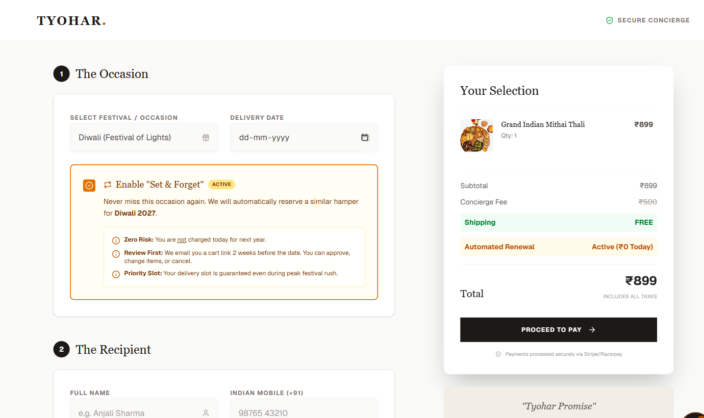

# Tyohar - automated festival gifting case study

**Live:** https://auto-delivery-seven.vercel.app
**Problem:** Indians abroad want to send festival gifts home, but gift choice, delivery timing, and annual reminders are usually split across separate errands.
**Solution:** Tyohar turns that into one guided flow: curated collections, cart, checkout concierge details, and a visible "Set & Forget" annual renewal option.
**Demo path:** Open `/products`, add "Grand Indian Mithai Thali", proceed to `/checkout`, enable "Set & Forget", and review the renewal summary.
**Run locally:** `npm install && npm run dev`, then open `http://localhost:3000`.
**Stack:** Next.js 16 App Router, React 19, Tailwind CSS 4, Motion, and a Nodemailer waitlist endpoint.
**What to inspect:** festival/category filters, cart drawer, recipient scheduling, annual automation upsell, and waitlist CTA.
**Status:** Deployed on Vercel; checkout/payment is prototype UI, and `/api/waitlist` requires SMTP environment variables.
