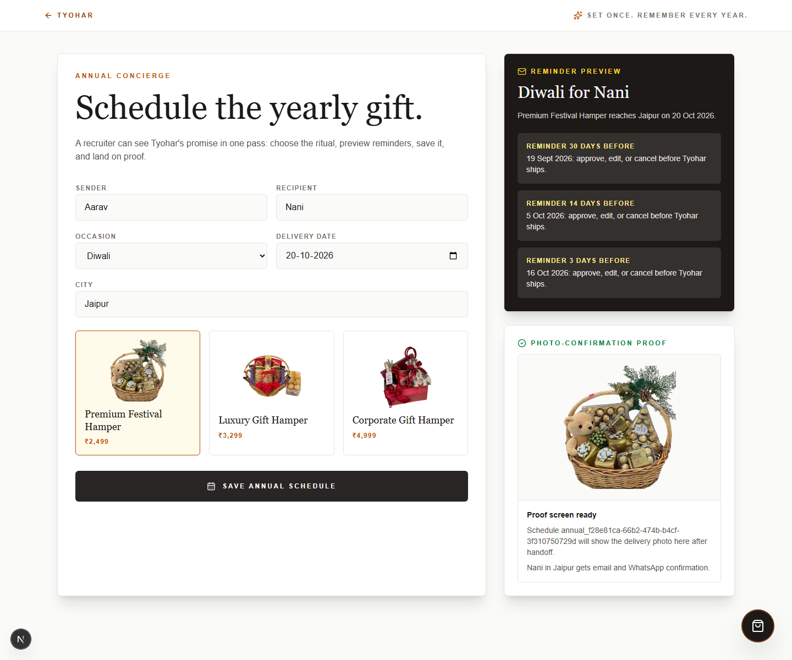

# Tyohar Annual Gifting Scheduler
Install: `pnpm install --frozen-lockfile`
Run: `pnpm dev --hostname 127.0.0.1 --port 3010`
Open: `http://127.0.0.1:3010/annual-gifting`
Demo: edit the yearly gift details or use the prefilled recruiter path.
State 1: schedule a recurring occasion, recipient, city, date, and hamper.
State 2: preview the 30, 14, and 3 day reminder messages.
State 3: save and land on the photo-confirmation proof panel.
Persistence: saves to ignored local JSON at `var/annual-gifting-schedules.json`.
Screenshot: 
