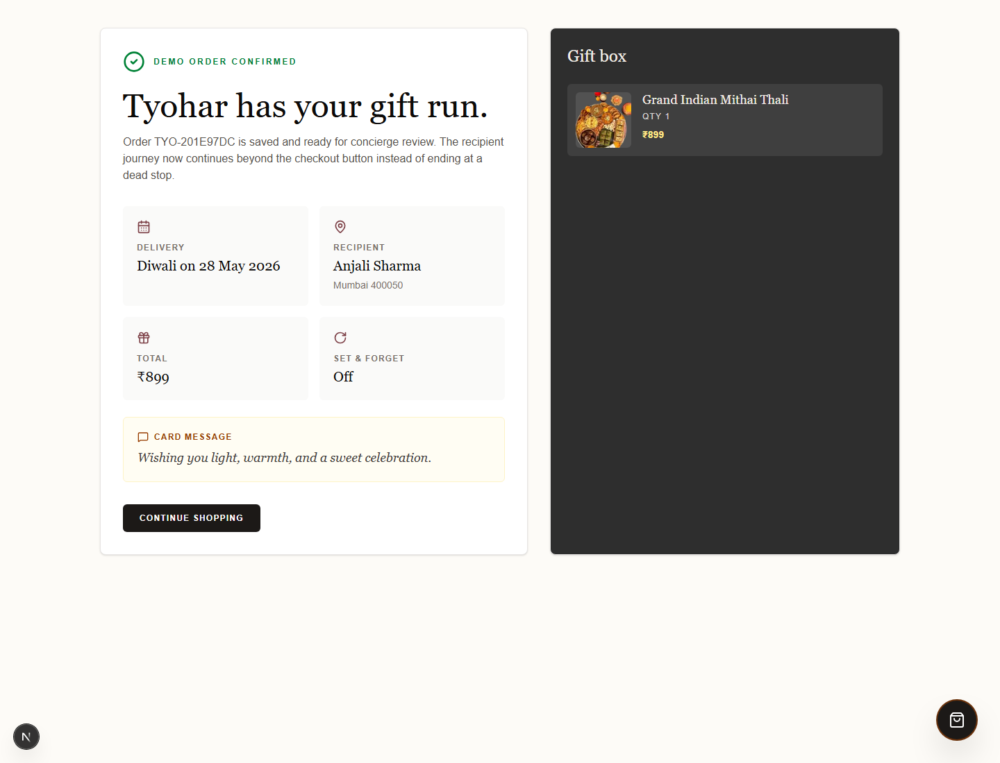

# Tyohar Demo Flow
Checkout confirmation slice for the product -> cart -> checkout -> confirmation recruiter demo.
Run locally:
`npm install && npm run dev`
Open `http://localhost:3000/products` and add a gift to the cart.
Use the floating gift box to continue to checkout.
Fill recipient details, then place the demo order.
Orders are saved locally in `.data/orders.json`.
Screenshot:

